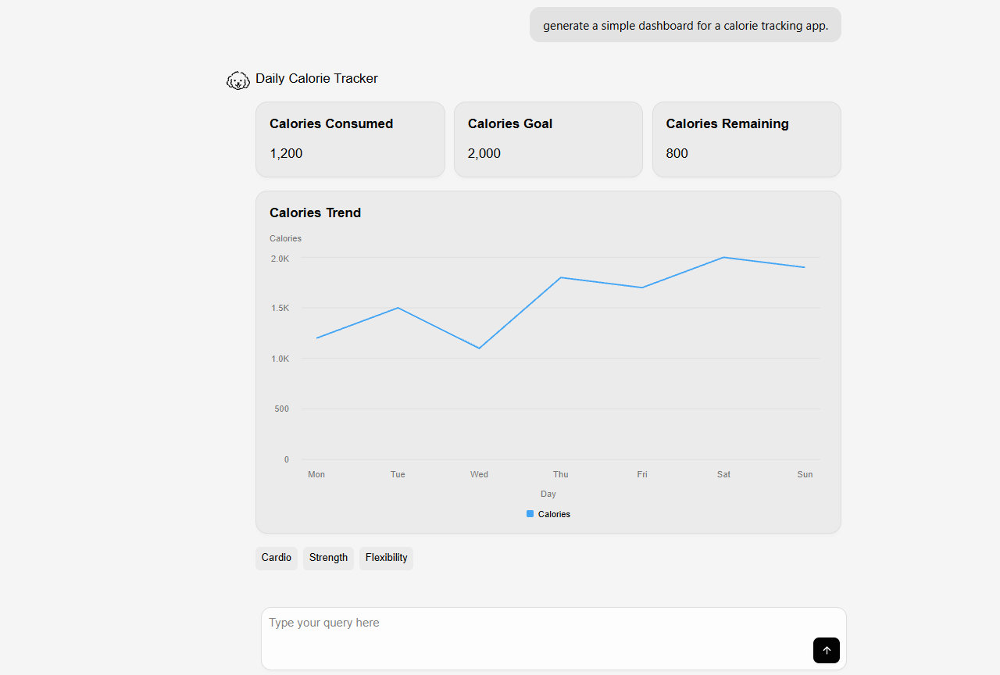

# OpenUI + Ollama Local Setup

A minimal OpenUI + Ollama setup configured using the official OpenUI CLI workflow.

This repository is a companion repo for the OpenUI + Ollama setup tutorial.

---

## Prerequisites

Install:

- [Node.js](https://nodejs.org/)
- [Ollama](https://ollama.com/download)

---

## 1. Pull an Ollama Model

Example:

```bash
ollama run gpt-oss:20b
```

Verify installed models:

```bash
ollama list
```

---

## 2. Create the `.env` File

Linux/macOS:

```bash
cp .env.example .env
```

Windows PowerShell:

```powershell
Copy-Item .env.example .env
```

You can replace the `MODEL` value with any supported Ollama local or cloud-hosted model.

---

## 3. Start the Development Server

```bash
npm install
npm run dev
```

Open:

```txt
http://localhost:3000
```

---

## Tested Models

### Local Models
- `qwen2.5-coder:14b`
- `gpt-oss:20b`

### Cloud Models
- `nemotron-3-super:cloud`
- `qwen3-next:80b-cloud`
- `gemma4:31b-cloud`

> Some cloud-hosted models may require subscriptions or gated access.

---

## Notes

- Smaller local models may generate malformed `openui-lang` output.
- Increasing Ollama context length may improve generation quality.
- Larger models generally produced more stable UI layouts during testing.

## Example Output

